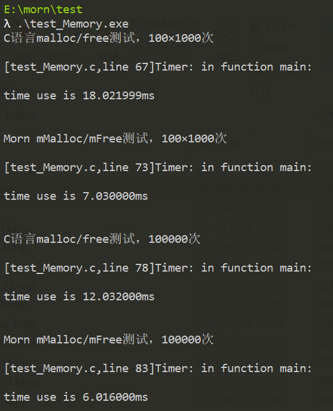

## Morn：内存池

在Morn的源码里，所有的内存申请和释放都是对Morn内存池的操作。

什么是内存池就不多废话了，百度一下全都知道。这里说一下为什么在Morn里要使用内存池（其实百度一下也都知道，不展开说了）。两个目的，首先是**避免内存碎片化**，这个是主要原因，其次是加快内存申请释放的速度，这个是打草搂兔子，这个速度不是很重要。

#### 接口

Morn的内存池接口函数就两个：

```C
void *mMalloc(int size);
void mFree(void *ptr);
```

其中`mMalloc`的作用和C语言里面的`malloc`一样，使用方法也一样，`mFree`的作用和C语言里面的`free`一样，使用方法也一样，也就是说，`mMalloc`用来在内存池里面申请空间，`mFree`用来把从内存池里申请的空间释放掉。

这里强调一点：所有使用`mMalloc`申请的内存空间，都必须而且只能用`mFree`来释放。所有`mFree`所释放的内存空间都必须而且只能是由`mMalloc`申请得到的。


#### 性能

比较一下`mMalloc`、`mFree`和原生的`malloc`、`free`的速度，写了下面的测试程序（Morn/test/test_Memory.c文件）：

```c
#include <stdio.h>
#include <stdlib.h>
#include <string.h>

#include "morn_Util.h"

void morn_mem_test(int test_num)
{
    int *data[128];
    memset(data,0,128*sizeof(int *));
    
    for(int i=0;i<test_num;i++)
    {
        int idx = mRand(0,128);
        if(data[idx]==NULL)
        {
            int size = mRand(1,1023);
            data[idx] = mMalloc(size);
        }
        else
        {
            mFree(data[idx]);
            data[idx] = NULL;
        }
    }
    
    for(int i=0;i<128;i++)
    {
        if(data[i]!=NULL)
            mFree(data[i]);
    }
}

void c_mem_test(int test_num)
{
    int *data[128];
    memset(data,0,128*sizeof(int *));
    
    for(int i=0;i<test_num;i++)
    {
        int idx = mRand(0,128);
        if(data[idx]==NULL)
        {
            int size = mRand(1,1023);
            data[idx] = malloc(size);
        }
        else
        {
            free(data[idx]);
            data[idx] = NULL;
        }
    }
    
    for(int i=0;i<128;i++)
    {
        if(data[i]!=NULL)
            free(data[i]);
    }
}

int main()
{
    mLog(INFO,"C语言malloc/free测试，100×1000次");
    mTimerBegin();
    for(int i=0;i<100;i++)
        c_mem_test(1000);
    mTimerEnd();
    
    mLog(INFO,"Morn mMalloc/mFree测试，100×1000次");
    mTimerBegin();
    for(int i=0;i<100;i++)
        morn_mem_test(1000);
    mTimerEnd();
    
    mLog(INFO,"C语言malloc/free测试，100000次");
    mTimerBegin();
    c_mem_test(100000);
    mTimerEnd();
    
    mLog(INFO,"Morn mMalloc/mFree测试，100000次");
    mTimerBegin();
    morn_mem_test(100000);
    mTimerEnd();
}
```

上面的代码也就是循环申请和释放随机大小的内存空间（在1字节至1K字节之间），得到的结果如下




通过十万次的申请和释放，可以看到，在Morn的内存池上申请和释放内存大概比直接用`malloc`、`free`申请释放内存要快2倍左右。

当然，只要你不去这么变态的不停的申请释放内存，这个速度不那么重要。