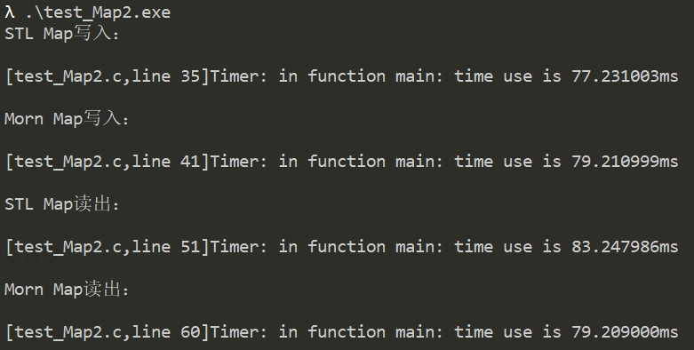

## Morn：key-value映射

映射就是键值表，表中每个元素由两部分组成，即键（key）和值（value），只要输入键就能找到相应的值。

在Morn中，映射是用链表MChain来实现的。在键值表中增加一个映射也就是在链表中插入一个节点，在兼职表中删除一个映射也就是在链表中删除一个节点。（当然怎么快速的找到节点位置、插入节点、删除节点，这是算法需要解决的问题）

在Morn中，映射键值对中的键和值都可以是任意数据类型（整数、浮点数、字符串、数组、指针、结构体等）。

值得一提的是Morn的map不是红黑树，是二分查找。


### 接口

映射（map）首先是链表（MChain），所以在使用映射之前，需要先使用`mChainCreate`函数来创建映射（链表），在使用结束后需要使用`mChainRelease`函数来释放映射（链表）。

除此以外，映射增加的操作主要有：


#### 向映射中写入键值对

``` c
void *mMapWrite(MChain *map,const void *key,const void *value);
void *mMapWrite(MChain *map,const void *key,int key_size,const void *value,int value_size);
```

这里，key就是键，指向任意类型的指针，key_size是key的长度（字节），如果key的类型是字符串，可不设置key_size或设置为DFLT。

value是key所对应的值，也是指向任意类型的指针，value_size是value的长度（字节），如果value的类型是字符串，那么value_size可不设置或设置为DFLT。

函数的返回值是value在map中存储的内存地址。

这里注意：对于每一个键值对，键必须是唯一的，如果两个键值对的键是相同的，那么后写入的将会覆盖之前的。


#### 从映射中读取键值对

```c
void *mMapRead(MChain *map,const char *key);
void *mMapRead(MChain *map,const char *key,char *value);
void *mMapRead(MChain *map,const void *key,int key_size,void *value,int value_size);
```

key是要读取的键，key_size是键的长度（字节），key为字符串时可不设置key_size或设置为DFLT。

value是要读出值的保存位置的指针，如果只是读，不需要copy到value指向的位置，那么value可以为NULL，value为NULL时，value_size没有意义，否则，value_size是要copy的字节数，value为字符串的话可以设置为DFLT。

函数返回值是所找到的key对应的value值在map中的内存地址。


#### 删除键值对

```c
void mMapDelete(MChain *map,const char *key);
void mMapDelete(MChain *map,const void *key,int key_size);
```

这就是把键为key的键值对从映射里删除掉。key_size在为字符串时可不设置或设置为DFLT。


#### Map遍历

```c
void mMapNodeOperate(MChain *map,void (*func)(const void *,const int,void *,int,void *),void *para);
```

其中func是遍历时对每个Node的操作函数，其必须使用以下形式：

```c
void func(const void *key,const int key_size,void *value,int value_size,void *para);
```

para是func中使用的参数。

注意：key-value在map中的排列是有序的，遍历时不能改变key的值，否则将破坏其有序性。


### 示例

下面是一个示例程序：

```c
int main()
{
    MChain *map = mChainCreate();
    
    int n;
    n=0; mMapWrite(map,"zero" ,DFLT,&n,sizeof(int));
    n=1; mMapWrite(map,"one"  ,DFLT,&n,sizeof(int));
    n=2; mMapWrite(map,"two"  ,DFLT,&n,sizeof(int));
    n=3; mMapWrite(map,"three",DFLT,&n,sizeof(int));
    n=4; mMapWrite(map,"four" ,DFLT,&n,sizeof(int));
    n=5; mMapWrite(map,"five" ,DFLT,&n,sizeof(int));
    n=6; mMapWrite(map,"six"  ,DFLT,&n,sizeof(int));
    n=7; mMapWrite(map,"seven",DFLT,&n,sizeof(int));
    n=8; mMapWrite(map,"eight",DFLT,&n,sizeof(int));
    n=9; mMapWrite(map,"nine" ,DFLT,&n,sizeof(int));
    
    int *p;
    p = mMapRead(map,"zero" );if(p!=NULL)printf("zero = %d\n",*p);
    p = mMapRead(map,"one"  );if(p!=NULL)printf("one  = %d\n",*p); 
    p = mMapRead(map,"two"  );if(p!=NULL)printf("two  = %d\n",*p); 
    p = mMapRead(map,"three");if(p!=NULL)printf("three= %d\n",*p);
    p = mMapRead(map,"four" );if(p!=NULL)printf("four = %d\n",*p);
    p = mMapRead(map,"five" );if(p!=NULL)printf("five = %d\n",*p);
    p = mMapRead(map,"six"  );if(p!=NULL)printf("six  = %d\n",*p);
    p = mMapRead(map,"seven");if(p!=NULL)printf("seven= %d\n",*p);
    p = mMapRead(map,"eight");if(p!=NULL)printf("eight= %d\n",*p);
    p = mMapRead(map,"nine" );if(p!=NULL)printf("nine = %d\n",*p);
    p = mMapRead(map,"ten"  );if(p!=NULL)printf("ten  = %d\n",*p);
    
    mChainRelease(map);
    return 0;
}
```

此例是往映射里写入了十个键值对，然后再分别读出并打印，程序运行结果为：

```
zero = 0
one  = 1
two  = 2
three= 3
four = 4
five = 5
six  = 6
seven= 7
eight= 8
nine = 9
```

上例中，键为字符串，值为数字。当然也可以反过来，键是数字，值是字符串，如下例：

```c
int main()
{
    MChain *map = mChainCreate();
    
    int n;
    n=0; mMapWrite(map,&n,sizeof(int),"zero" ,DFLT);
    n=1; mMapWrite(map,&n,sizeof(int),"one"  ,DFLT);
    n=2; mMapWrite(map,&n,sizeof(int),"two"  ,DFLT);
    n=3; mMapWrite(map,&n,sizeof(int),"three",DFLT);
    n=4; mMapWrite(map,&n,sizeof(int),"four" ,DFLT);
    n=5; mMapWrite(map,&n,sizeof(int),"five" ,DFLT);
    n=6; mMapWrite(map,&n,sizeof(int),"six"  ,DFLT);
    n=7; mMapWrite(map,&n,sizeof(int),"seven",DFLT);
    n=8; mMapWrite(map,&n,sizeof(int),"eight",DFLT);
    n=9; mMapWrite(map,&n,sizeof(int),"nine" ,DFLT);
    
    char *p;
    n=0; p = mMapRead(map,&n,sizeof(int),NULL,DFLT);printf("%d = %s\n",n,p);
    n=1; p = mMapRead(map,&n,sizeof(int),NULL,DFLT);printf("%d = %s\n",n,p); 
    n=2; p = mMapRead(map,&n,sizeof(int),NULL,DFLT);printf("%d = %s\n",n,p); 
    n=3; p = mMapRead(map,&n,sizeof(int),NULL,DFLT);printf("%d = %s\n",n,p);
    n=4; p = mMapRead(map,&n,sizeof(int),NULL,DFLT);printf("%d = %s\n",n,p);
    n=5; p = mMapRead(map,&n,sizeof(int),NULL,DFLT);printf("%d = %s\n",n,p);
    n=6; p = mMapRead(map,&n,sizeof(int),NULL,DFLT);printf("%d = %s\n",n,p);
    n=7; p = mMapRead(map,&n,sizeof(int),NULL,DFLT);printf("%d = %s\n",n,p);
    n=8; p = mMapRead(map,&n,sizeof(int),NULL,DFLT);printf("%d = %s\n",n,p);
    n=9; p = mMapRead(map,&n,sizeof(int),NULL,DFLT);printf("%d = %s\n",n,p);
    
    mChainRelease(map);
    return 0;
}
```

运行结果为：

```
0 = zero  
1 = one   
2 = two   
3 = three 
4 = four  
5 = five  
6 = six   
7 = seven 
8 = eight 
9 = nine  
```


### 性能

这里写了一个测试程序，用以比较Morn中映射和C++ STL中的map。

```c
#include "morn_util.h"

#include <map>
#include <string>
#include <iostream>

void test1(int number)
{
    int i,j;
    
    char *key=(char *)malloc(number*32*sizeof(char));
    for(i=0;i<number;i++)
    {
        int size = mRand(10,31);
        for(j=0;j<size;j++)
            key[i*32+j] = mRand('a','z');
        key[i*32+j]=0;
    }
    
    std::map<std::string,int> cpp_map;
    MChain *morn_map = mChainCreate();
    
    printf("number=%d:\n",number);
    mTimerBegin("STL map write");
    for(i=0;i<number;i++)
        cpp_map.insert(std::pair<std::string,int>(&(key[i*32]),i));
    mTimerEnd("STL map write");
    
    mTimerBegin("Morn map write");
    for(i=0;i<number;i++)
        mMapWrite(morn_map,&(key[i*32]),DFLT,&i,sizeof(int));
    mTimerEnd("Morn map write");
    
    std::map<std::string,int>::iterator iter;
    mTimerBegin("STL map read");
    for(i=0;i<number;i++)
    {
        int index = mRand(0,number);
        iter = cpp_map.find(&(key[index*32]));
    }
    mTimerEnd("STL map read");
    
    mTimerBegin("Morn map read");
    for(i=0;i<number;i++)
    {
        int index = mRand(0,number);
        int *value = (int *)mMapRead(morn_map,&(key[index*32]),DFLT,NULL,DFLT);
    }
    mTimerEnd("Morn map read");

    mChainRelease(morn_map);
    free(key);
}

void test2(int number)
{
    int i,j;
    
    char *value=(char *)malloc(number*32*sizeof(char));
    for(i=0;i<number;i++)
    {
        int size = mRand(10,31);
        for(j=0;j<size;j++)
            value[i*32+j] = mRand('a','z');
        value[i*32+j]=0;
    }
    
    std::map<int,std::string> cpp_map;
    MChain *morn_map = mChainCreate();

    printf("number=%d:\n",number);
    
    mTimerBegin("STL map write");
    for(i=0;i<number;i++)
        cpp_map.insert(std::pair<int,std::string>(i,&(value[i*32])));
    mTimerEnd("STL map write");
    
    mTimerBegin("Morn map write");
    for(i=0;i<number;i++)
        mMapWrite(morn_map,&i,sizeof(int),&(value[i*32]),DFLT);
    mTimerEnd("Morn map write");
    
    std::map<int,std::string>::iterator iter;
    mTimerBegin("STL map read");
    for(i=0;i<number;i++)
    {
        int index = mRand(0,number);
        iter = cpp_map.find(index);
    }
    mTimerEnd("STL map read");
    
    mTimerBegin("Morn map read");
    for(i=0;i<number;i++)
    {
        int index = mRand(0,number);
        char *value = (char *)mMapRead(morn_map,&index,sizeof(int),NULL,DFLT);
    }
    mTimerEnd("Morn map read");

    mChainRelease(morn_map);
    free(value);
}

int main()
{
    test1(10000);
    test1(100000);
    test1(1000000);
    
    test2(10000);
    test2(100000);
    test2(1000000);
    return 0;
}
```

如上所示，先分别向Morn的Map和STL的Map中写入100000个键值对，用以测试写入性能。然后随机的从其中读取100000次，用以测试读取性能。

测试结果如下：



由上可见，当键值节点数小于等于100000时，Morn的速度较STL有优势，当键值节点数大于1000000时，STL较Morn有优势。（你真的会使用一百万个键值节点吗？）


