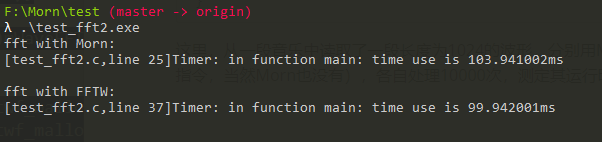

## Morn：傅里叶变换

众所周知，傅里叶变换是音频处理里最基础最重要的算法。想了解什么是FFT、为什么要做FFT、以及怎么做FFT的同志们，烦请百度。


### 接口

#### 快速傅里叶变换

```c
void mWaveFFT(MWave *src,MWave *dst)；
```

接口极其简单的函数。src是输入的时域的波形，dst是输出频域的波形。

注意，dst的通道数将是src通道数的两倍。这是因为输出的频域波形是复数，有实部通道和虚部通道（偶数通道（0/2/4等）是实部通道，奇数通道（1/3/5等）是虚部通道）。

src的长度要求大于4，但不要求是二进制整数（非整数长度时补零）。

dst的长度必然是二进制整数（4/8/16..1024/2048等）。

#### 快速傅里叶逆变换

```c
void mWaveIFFT(MWave *src,MWave *dst)；
```

这就是FFT的逆操作。src是输入的频域的波形，dst是输出时域的波形。

注意，src频域波形是复数，因此其通道数将是dst的两倍，这与FFT是一样的。

src的长度必然是二进制整数。

dst的输出长度与src相同。


### 示例

```c
int main()
{
    MWave *src = mWaveCreate(1,10,NULL);
    MWave *fft = mWaveCreate(DFLT,DFLT,NULL);
    MWave *dst = mWaveCreate(DFLT,DFLT,NULL);
    
    printf("src->size is %d.\n",src->size);
    for(int i=0;i<src->size;i++) 
    {
        src->data[0][i]=((float)mRand(0,100))/100.0f; 
        printf("%f,",src->data[0][i]);
    }
    
    mWaveFFT(src,fft);
    
    printf("\n\nfft->size is %d.\n",fft->size);
    for(int i=0;i<fft->size;i++) 
        printf("%f+%fi,",fft->data[0][i],fft->data[1][i]);
    
    mWaveIFFT(fft,dst);
    
    printf("\n\ndst->size is %d.\n",dst->size);
    for(int i=0;i<dst->size;i++) 
        printf("%f,",dst->data[0][i]);
    
    mWaveRelease(src);
    mWaveRelease(fft);
    mWaveRelease(dst);
}
```

这里生成了一个随机的波形，然后对其进行傅里叶变换。随后再将傅里叶变换的结果进行逆变换。

程序得到的运行结果如下：

```
src->size is 10.
-0.590000,-0.330000,0.340000,0.000000,0.690000,0.240000,-0.220000,0.580000,0.620000,-0.360000,

fft->size is 16.
0.970000+0.000000i,-1.413998+-1.230021i,-0.907487+0.507731i,-1.594725+0.133425i,0.600000+1.030000i,-1.617235+-1.076870i,-0.412513+1.627731i,-0.214043+0.319685i,0.710000+0.000000i,-0.214043+-0.319685i,-0.412513+-1.627731i,-1.617235+1.076870i,0.600000+-1.030000i,-1.594725+-0.133425i,-0.907487+-0.507731i,-1.413998+1.230021i, 

dst->size is 16.
-0.590000,-0.330000,0.340000,-0.000000,0.690000,0.240000,-0.220000,0.580000,0.620000,-0.360000,0.000000,-0.000000,0.000000,0.000000,-0.000000,0.000000,
```

可以看到经过傅里叶变换和逆变换后的波形与输出波形一致（后面补零）。


### 性能

这里我们将Morn的傅里叶函数与著名的FFTW库进行了比较。

```c
int main()
{
    MFile *file = mFileCreate("E:/test.wav");
    MWave *src = mWaveCreate(1,1024,NULL);
    MWave *dst = mWaveCreate(2,1024,NULL);
    mWAVRead(file,src);

    printf("fft with Morn:\n");
    mTimerBegin();
    for(int i=0;i<10000;i++)mWaveFFT(src,dst);
    mTimerEnd();
    
    fftwf_complex *in  = fftwf_malloc(sizeof(fftwf_complex) * 1024);
    fftwf_complex *out = fftwf_malloc(sizeof(fftwf_complex) * 1024);
    for(int i=0;i<1024;i++){in[i][0]=src->data[0][i];in[i][1]=0;}

    printf("fft with FFTW:\n");
    mTimerBegin();
    fftwf_plan plan = fftwf_plan_dft_1d(1024,in,out,FFTW_FORWARD,FFTW_ESTIMATE);
    for(int i=0;i<10000;i++) fftwf_execute(plan);
    fftwf_destroy_plan(plan);
    fftwf_cleanup();
    mTimerEnd();
    
    fftwf_free(in);
    fftwf_free(out);
    
    mFileRelease(file);
    mWaveRelease(src);
    mWaveRelease(dst);
}
```

这里，从一段音乐中读取了一段长度为1024的波形，分别用Morn和fftw进行傅里叶变换（这里fftw没有使用SIMD指令，当然Morn也没有），各自处理10000次，测定其运行时间，得到的结果如下：



必须承认FFTW很优秀，终究还是比Morn快一点儿，但两者速度差别在10%以内。