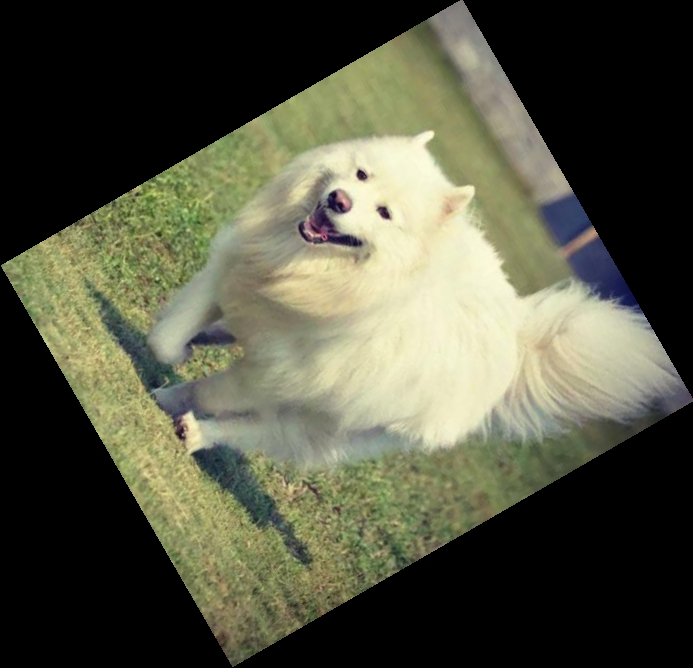
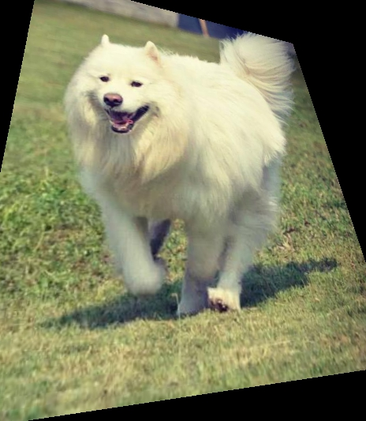

## Morn：图像坐标变换

其实之前说过的图像缩放也是图像坐标变换的一种，只不过缩放比较常用，所以单独拿出来说了。这里说说其它的图像坐标变换。

#### 接口

##### 图像旋转

```c
void mImageRotate(MImage *src,MImage *dst,MImagePoint *src_hold,MImagePoint *dst_hold,float angle);
```

这里，src是输入的源图像，dst是输出的旋转后的图像，dst的默认值是src（也就是保存回原图），这里需要说明的是，dst如果没有设置明确的图像尺寸的话，输出图像将与输入图像同尺寸。

src_hold和dst_hold是图像的旋转点（图像绕着这个点做旋转，dst上的dst_hold就对应了src上的src_hold）。如果不指定旋转点（输入是DFLT）的话，那么旋转点将取图像上的中央点。换一个说法，做图像旋转的时候可以同时做图像平移，src_hold和dst_hold取默认值的意思就是不做平移。

angle是图像的旋转角度（顺时针，注意是角度不是弧度），默认值是90度。

比如：

```c
mImageRotate(src,dst,DFLT,DFLT,60);
```

它的执行结果如下：




#### 图像仿射变换

```c
void mImageAffineCorrection(MImage *src,MImage *dst,MImagePoint *ps,MImagePoint *pd);
```

这里，src是输入的源图像，dst是输出的旋转后的图像，dst的默认值是src（也就是保存回原图），这里需要说明的是，dst如果没有设置明确的图像尺寸的话，输出图像将与输入图像同尺寸。

ps是源图像上的点坐标，pd是变换后图像上与ps对应的点。在仿射变换中，ps和pd点的个数都是3个。

比如：

```c
ps[0].x=  0;ps[0].y= 0;ps[1].x= 0;ps[1].y=200;ps[2].x=100;ps[2].y=100;
pd[0].x=-20;pd[0].y=10;pd[1].x=30;pd[1].y=180;pd[2].x= 90;pd[2].y=120;
mImageAffineCorrection(src,dst,ps,pd);
```

它的执行结果如下：


#### 图像透视变换

```c
void mImagePerspectiveCorrection(MImage *src,MImage *dst,MImagePoint *ps,MImagePoint *pd);
```

这里，src是输入的源图像，dst是输出的旋转后的图像，dst的默认值是src（也就是保存回原图），这里需要说明的是，dst如果没有设置明确的图像尺寸的话，输出图像将与输入图像同尺寸。

ps是源图像上的点坐标，pd是变换后图像上与ps对应的点。在仿射变换中，ps和pd点的个数都是4个。

比如：

```c
ps[0].x=  0;ps[0].y= 0;ps[1].x= 0;ps[1].y=500;
ps[2].x=500;ps[2].y=500;ps[3].x=500;ps[3].y= 0;
pd[0].x= 50;pd[0].y=-30;pd[1].x=-50;pd[1].y=480;
pd[2].x=520;pd[2].y=420;pd[3].x=390;pd[3].y=60;
mImagePerspectiveCorrection(src,perspective,ps,pd);
```

它的执行结果如下：




#### 通用坐标变换

```c
void mImageCoordinateTransform(MImage *src,MImage *dst,float (*x_func)(int,int,void *),float (*y_func)(int,int,void *),void *para);
```

这里，src是输入的源图像，dst是输出的旋转后的图像，dst的默认值是src（也就是保存回原图），这里需要说明的是，dst如果没有设置明确的图像尺寸的话，输出图像将与输入图像同尺寸。

x_func是x坐标的计算公式。y_func是y坐标的计算公式，para是x_func和y_func的参数。

比如：

```c
float x_transform(int x,int y,void *para) {return ( 0.0022*x*x+0.38*x+0.31*y-150);}
float y_transform(int x,int y,void *para) {return (-0.0023*x*y+1.66*y+0.11*x-55);}
mImageCoordinateTransform(src,transform,x_transform,y_transform,NULL);
```

它的执行结果是：


多说一句：图像旋转是一种特殊的仿射变换，仿射变换是一种特殊的透视变换，透视变换是一种特殊的坐标变换。