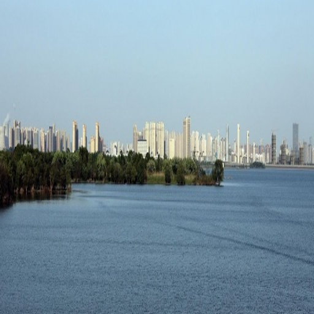
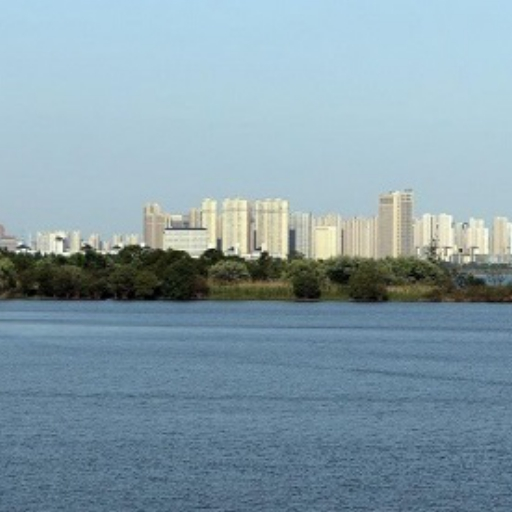
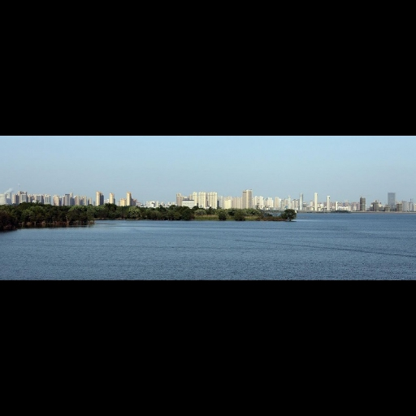
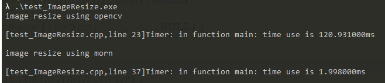

## Morn：图像缩放

#### 接口

```c
void mImageResize(MImage *src,MImage *dst,int height,int width,int type);
```

其中：src是输入图像，dst是缩放后的图像。height和width是缩放后的图像宽度和图像高度，它俩的默认值是dst的图像尺寸，也就是说以下两种写法是等效的：

```c
//可以这么写：
MImage *dst = mImageCreate(cn,256,256,NULL);
mImageResize(src,dst,DFLT,DFLT,DFLT);
//也可以这么写：
MImage *dst = mImageCreate(cn,DFLT,DFLT,NULL);
mImageResize(src,dst,256,256,DFLT);
```

不过，如果dst==NULL或者dst==src的话，height和width显然是必须指定的。

type是缩放方法：

其一，可以指定缩放的插值方法：线性插值（MORN_INTERPOLATE）或者取临近点（MORN_NEAREST），两种方法必须选其一，默认值是线性插值。

其二，可以选择缩放的比例：不按比例缩放（MORN_RESIZE_UNUNIFORM）或者按照最小等比例缩放（MORN_RESIZE_MINUNIFORM）再或者按照最大等比例缩放（MORN_RESIZE_MAXUNIFORM）。默认值是不按比例缩放。

参见以下的示例：

```c
//线性插值、不按比例缩放
mImageResize(src,dst,DFLT,DFLT,DFLT);
//线性插值、最小等比例缩放
mImageResize(src,dst,DFLT,DFLT,MORN_RESIZE_MINUNIFORM);
//线性插值、最大等比例缩放
mImageResize(src,dst,DFLT,DFLT,MORN_RESIZE_MAXUNIFORM);
//取临近点、不按比例缩放
mImageResize(src,dst,DFLT,DFLT,MORN_RESIZE_NEAREST);
//取临近点、最小等比例缩放
mImageResize(src,dst,DFLT,DFLT,MORN_NEAREST&MORN_RESIZE_MINUNIFORM);
//取临近点、最大等比例缩放
mImageResize(src,dst,DFLT,DFLT,MORN_NEAREST&MORN_RESIZE_MAXUNIFORM);
```

原图：


不按比例缩放：



最小等比例缩放：



最大等比例缩放：



#### 性能

这里和OpenCV里的图像缩放来作对比，以下为测试程序：

```c
#include <stdlib.h>
#include <string.h>

#include "opencv2/opencv.hpp"
#include "opencv2/imgproc/imgproc.hpp"

#include "morn_Image.h"

using namespace cv;
int main()
{
    //////////////////////////////////////////////////////////////
    mLog(INFO,"image resize using opencv");
    Mat src = imread("./test.jpg"); 
    Mat dst;
    
    mTimerBegin();
    for(int i=0;i<10;i++)
        resize(src,dst,Size(256,256),(0, 0),(0, 0),INTER_LINEAR);
    mTimerEnd();
    
    imwrite("./test_resize_cv.jpg",dst);
    //////////////////////////////////////////////////////////////
    
    //////////////////////////////////////////////////////////////
    mLog(INFO,"image resize using morn");
    MImage *in = mImageCreate(DFLT,DFLT,DFLT,NULL);
    mImageLoad("./test.jpg",in);
    MImage *out = mImageCreate(in->cn,256,256,NULL);
    
    mTimerBegin();
    for(int i=0;i<10;i++)
        mImageResize(in,out,DFLT,DFLT,DFLT);
    mTimerEnd();
    
    mImageSave(out,"./test_resize_morn.jpg");
    
    mImageRelease(in);
    mImageRelease(out);
    //////////////////////////////////////////////////////////////

    return 0;
}
```

这个就是把一张图像，缩放到256*256大小，方法都是采用双线性插值和非等比例缩放，测试了10次用以统计程序执行时间。结果如下：



我听说OpenCV做图像缩放很慢，测了以后发现它真的很慢，OpenCV在做图像缩放的时候到底在干什么？