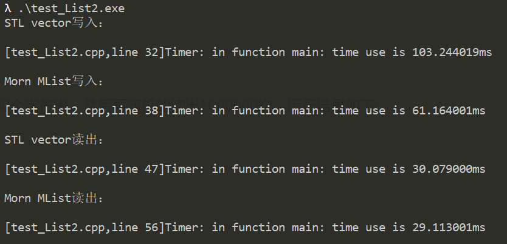

## Morn：容器

Morn里面的容器是表（MSheet）和单（MList）。表就是表格，有行有列，是一个二维容器。单就是清单，是一个一维容器。

其中，一维的MList又比二维的MSheet用得更普遍，这里重点讲MList。

MList是个筐，啥都可以装。

存入MList容器的可以是任何元素，这个元素可以是一个数值、一个数组、一个字符串、一个指针或者一个结构体、联合体等等，总之C语言里所有允许的数据类型（包括C语言本身提供的类型和用户自己定义的类型）都可以放进MList容器里。而且存入MList的可以是不同类型的元素（如果你需要的话），比Mlist的第一个元素可以是int数值、第二个元素可以是一个图像、第三个元素可以是一个矩阵，第四个元素是另一个MList，诸如此类。


### 定义

MList的定义在[../include/morn_Util.h]()文件里：

```C
typedef struct MList
{
    int num;
    void **data;
    struct MList *handle;
    MInfo info;
    void *reserve;
}MList;
```

结构体中：handle、info和reserve是几乎所有Morn结构体所共有的，就不多介绍了。除此以外就只有num和data两个成员，num是容器中元素的个数，data是容器中每个元素的地址。


### 接口

此文档MList的相关函数都定义在[../src/util/morn_list.c](../src/util/morn_list.c)文件中。


#### 创建一个MList

```C
MList *mListCreate(int num,void **data);
```

其中num是容器中元素的个数，data是每个元素的地址（共num个）。最常见的是创建一个空的容器:

`MList *list = mListCreate(0,NULL);`或`MList *list = mListCreate(DFLT,NULL);`


#### 释放一个MList

```c
void mListRelease(MList *list);
```

用`mListCreate`创建的Mlist必须且只能用`mListRelease`来释放。


#### 设置MList元素

```c
void mListPlace(MList *list,void *data,int num,int size);
```

这个函数用于设置容器的容量和每个元素的大小。

此函数可以用来讲数组元素转化成容器元素。其中data是一段连续存储的元素的首地址（例如数组的首地址），num是元素的个数，size是每个元素的大小，单位为字节。其中data可以设置为NULL，当data为NULL时，将会在list中存储num个size大小的不定元素（未经初始化的元素）。


#### MList扩容

```c
void mListAppend(MList *list,int num);
```

num是扩容后的容器的容量，默认值为（list->num+1），也就是说默认扩容一个元素。


#### 清空MList

```c
void mListClear(MList *list);
```

清空没有内存操作，只是把list->num设置为0。


#### 向Mlist中写入元素

```c
void *mListWrite(Mlist *list,int order,void *data,int size);
```

这个意思是，将大小为size个字节的元素data，写入到list的第order个位置。同时返回元素在容器中的指针（也就是list->data[order]）。

值得注意的是，order的值不能大于list->num（但是可以等于）。order的默认值是list->num，此时，就相当于stl::vector的push_back，也就是往容器中增加一个元素，这是list->num会加1，这是最常用的操作。

另外，这里面的data可以为NULL，当data==NULL的时候就是在容器里面申请了一个元素（size字节）的空间。

还有，如果你写入list的元素是一个字符串，那么size可以设置为DFLT。但是注意，如果(size==DFLT)&&(data==NULL)，是没有意义的，会报错。

另外说一点，同一个MList也可以保存不同种类的元素（如果有必要的话）。例如以下程序是允许的。

```c
MList *list = mListCreate(DFLT,NULL);    //创建了一个MList
...
int a=1;
mListWrite(list,DFLT,&a,sizeof(int));           //向list中写入了一个整数
char *b="mornalgo";
mListWrite(list,DFLT,b,DFLT);                   //向list中写入了一个字符串
int *c=&a;
mListWrite(list,DFLT,&c,sizeof(int *));         //向list中写入了一个指针
MImageRect rect;
mListWrite(list,DFLT,&rect,sizeof(MImageRect)); //向list中写入了一个矩形
MList *list2 = mListCreate（DFLT,NULL);
mListWrite(list,DFLT,list2,sizeof(MList));      //向list中写入了另一个list

...
mListRelease(list);                     //释放了list
```


#### 从Mlist中读出元素

```C
void *mListRead(MList *list,int order,void *data,int size);
```

这个函数用的比较少（因为多数时候读出不需要用这个函数来读）。

这个的意思是，从list的第order位置，读出一个大小为size的元素到data指针所指的位置。同时返回元素在容器中的指针（也就是list->data[order]）。

如果data不为NULL，那么元素会被拷贝到data处。否则不拷贝。data==NULL的时候，size没有意义。

读出的元素为字符串时，size可以设置为DFLT。

order也可以设置为DFLT，order为默认值时，如果是第一次使用`mListRead`函数来读取元素，则读到的是list的第0个元素。否则读到的是上一次Read的下一个元素。也就是说设置为DFLT可以从0位置开始依次读出元素。当order==list->num的时候，返回值为NULL。


#### Mlist拷贝

```c
void mListCopy(MList *src,MList*dst);
```

将src拷贝到dst中。在Morn里（不限于MList）所有的copy函数都是深拷贝。浅拷贝的话可以使用

`MList *dst=mListCreate(src->num,src->data);`


#### 两个MList合并

```c
void mListMerge(MList *src1,MList *src2,MList *dst);
```

将两个MList：src1和src2合并成一个dst。dst可以是src1，也可以是src2，也可以既不是src1也不是src2，默认值是src1，在Morn中所有的src、dst都遵循这个规则。


#### 在Mlist中插入元素

```c
void mListElementInsert(MList *list,int order,void *data,int size);
```

这个和`mListWrite`的区别在于：`mListWrite`是写入第order个元素，如果原来第order处已有元素的话，就覆盖原来的元素。而`mListElementInsert`是在order位置插入一个元素，order之后的每个元素都会后移一个位置。当然如果order==list->num的话，两者没有区别。


#### 从MList中删除一个元素

```c
void mListElementDelete(MList *list,int order);
```

这个是把list中第order个元素删除掉。order之后的每个元素都前移一个位置。


### MList性能

写了一个程序如下，来测试Morn的MList和C++ STL里的容器vector。

```c
#include "morn_Util.h"

#include <iostream>
#include <algorithm>
#include <vector>
using namespace std;

#define TEST_NUM 1000000
int main()
{
    int i,j;
    char *data=(char *)malloc(TEST_NUM*32*sizeof(char));
    for(i=0;i<TEST_NUM;i++)
    {
        int size = mRand(10,31);
        for(j=0;j<size;j++)
            data[i*32+j] = mRand('a','z');
        data[i*32+j]=0;
    }
    
    vector<string> vec;
    MList *list = mListCreate(DFLT,NULL);
    
    mLog(INFO,"STL vector写入：");
    mTimerBegin();
    for(i=0;i<TEST_NUM;i++)
        vec.push_back(&(data[i*32]));
    mTimerEnd();
    
    mLog(INFO,"Morn MList写入：");
    mTimerBegin();
    for(i=0;i<TEST_NUM;i++)
        mListWrite(list,DFLT,&(data[i*32]),DFLT);
    mTimerEnd();
    
    mLog(INFO,"STL vector读出：");
    mTimerBegin();
    for(i=0;i<TEST_NUM;i++)
    {
        int idx = mRand(0,vec.size());
        const char *p=vec.at(idx).data();
    }
    mTimerEnd();
    
    mLog(INFO,"Morn MList读出：");
    mTimerBegin();
    for(i=0;i<TEST_NUM;i++)
    {
        int idx = mRand(0,list->num);
        const char *p=(const char *)(list->data[i]);
    }
    mTimerEnd();
    
    mListRelease(list);
    free(data);
    return 0;
}
```

这个程序就是往容器里写入了1000000个字符串，然后再随机的读出1000000次。运行结果如下：



可以看到，对于写入数据Morn大概比STL快40%左右，对于读出数据两者相当（其实可以认为读出数据耗时可忽略，这里的时间其实主要是运行`mRand`函数的时间）。


