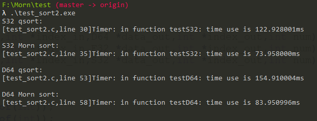
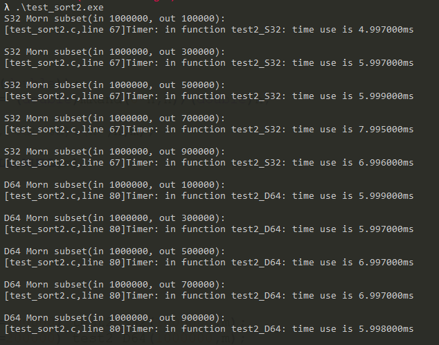

## Morn：排序

之前写了各种排序，后来都删掉了，现在的Morn里只保留了快速排序。

### 接口

此文档相关函数都定义在[../src/math/morn_sort.c](../src/math/morn_sort.c)里。

#### 升序排序

```c
void mAscSortD64(D64 *data_in,int *index_in,D64 *data_out,int *index_out,int num);
void mAscSortF32(F32 *data_in,int *index_in,F32 *data_out,int *index_out,int num);
void mAscSortS32(S32 *data_in,int *index_in,S32 *data_out,int *index_out,int num);
void mAscSortU32(U32 *data_in,int *index_in,U32 *data_out,int *index_out,int num);
void mAscSortS16(S16 *data_in,int *index_in,S16 *data_out,int *index_out,int num);
void mAscSortU16(U16 *data_in,int *index_in,U16 *data_out,int *index_out,int num);
void mAscSortS8 (S8  *data_in,int *index_in,S8  *data_out,int *index_out,int num);
void mAscSortU8 (U8  *data_in,int *index_in,U8  *data_out,int *index_out,int num);
```

或者，可以使用：

```c
void mAscSort(Type,Type* data_in,int *index_in,Type *data_out,int *index_out,int num);
```

其中，Type只支持D64（double），F32（float），S32（int），U32（unsigned int），S16（short），U16（unsigned short），S8（signed char） ，U8（unsigned char）八种类型。

data_in是数据的输入（待排序数据），data_out是数据的输出（排序后数据）。

data_out可以等于data_in，也就是输出覆盖输入。

data_out若设为NULL，则取其默认值为data_in，也即默认覆盖输入。

index_in是输入数据的顺序，index_out是输出数据的顺序，如果两者都取NULL，表示排序时不记录顺序。

index_in若取NULL，则表示使用默认的递增顺序，即0，1，2，3，……，num-1的顺序。

index_out可以等于index_in，也就是输出覆盖原输入顺序。

index_out若取NULL，则取默认值index_in，也即覆盖原输入顺序。

num是数据的个数。

例如：

```c
printf("\n\nin :");
for(int i=0;i<10;i++) {data[i] = mRand(-100,100);printf("%d,",data[i]);}
mAscSort(S32,data,NULL,NULL,index,10);
printf("\nout :");
for(int i=0;i<10;i++) {printf("%d(%d),",data[i],index[i]);}
```

其运行结果为

```
in :5,45,-19,-73,61,-9,95,42,-73,-64,
out :-73(8),-73(3),-64(9),-19(2),-9(5),5(0),42(7),45(1),61(4),95(6),
```


#### 降序排序

```c
void mDescSortD64(D64 *data_in,int *index_in,D64 *data_out,int *index_out,int num);
void mDescSortF32(F32 *data_in,int *index_in,F32 *data_out,int *index_out,int num);
void mDescSortS32(S32 *data_in,int *index_in,S32 *data_out,int *index_out,int num);
void mDescSortU32(U32 *data_in,int *index_in,U32 *data_out,int *index_out,int num);
void mDescSortS16(S16 *data_in,int *index_in,S16 *data_out,int *index_out,int num);
void mDescSortU16(U16 *data_in,int *index_in,U16 *data_out,int *index_out,int num);
void mDescSortS8 (S8  *data_in,int *index_in,S8  *data_out,int *index_out,int num);
void mDescSortU8 (U8  *data_in,int *index_in,U8  *data_out,int *index_out,int num);
```

或者，可以用：

```c
void mDescSort(Type,Type* data_in,int *index_in,Type *data_out,int *index_out,int num);
```

其参数与`mAscSort`相同，不再赘述。

例如：

```c
printf("\n\nin :");
for(int i=0;i<10;i++) {data[i] = mRand(-100,100);printf("%d,",data[i]);}
mDescSort(S32,data,NULL,NULL,NULL,10);
printf( "\nout :");
for(int i=0;i<10;i++) {printf("%d,",data[i]);}
```

其运行结果为

```
in :91,-96,2,53,-8,82,-79,16,18,-5,
out :91,82,53,18,16,2,-5,-8,-79,-96,
```


#### 最小值子集

也就是从num_in个数据里，取出num_out个最小的数，取出的数并无必要按照大小顺序排列。

```c
D64 mMinSubsetD64(D64 *data_in,int *index_in,int num_in,D64 *data_out,int *index_out,int num_out);
F32 mMinSubsetF32(F32 *data_in,int *index_in,int num_in,F32 *data_out,int *index_out,int num_out);
S32 mMinSubsetS32(S32 *data_in,int *index_in,int num_in,S32 *data_out,int *index_out,int num_out);
U32 mMinSubsetU32(U32 *data_in,int *index_in,int num_in,U32 *data_out,int *index_out,int num_out);
S16 mMinSubsetS16(S16 *data_in,int *index_in,int num_in,S16 *data_out,int *index_out,int num_out);
U16 mMinSubsetU16(U16 *data_in,int *index_in,int num_in,U16 *data_out,int *index_out,int num_out);
 S8 mMinSubsetS8 ( S8 *data_in,int *index_in,int num_in, S8 *data_out,int *index_out,int num_out);
 U8 mMinSubsetU8 ( U8 *data_in,int *index_in,int num_in, U8 *data_out,int *index_out,int num_out);
```

或者，可以用：

```c
Type mMinSubset(Type，Type *data_in,int *index_in,int num_in, Type *data_out,int *index_out,int num_out);
```

其参数Type、data_in、data_out、index_in、index_out与`mAscSort`相同，不再赘述。

num_in即输入数据的个数。num_out即输出数据的个数。

返回值是临界值，即输出数据中的最大值。

例如：

```c
printf("\n\nin :");
for(int i=0;i<10;i++) {data[i] = mRand(-100,100);printf("%d,",data[i]);}
mMinSubset(S32,data,NULL,10,NULL,index,4);
printf( "\nout :");
for(int i=0;i<4;i++) {printf("%d(%d),",data[i],index[i]);}
    
```

其运行结果为

```
in :47,-56,-38,57,-63,-41,23,41,29,78,
out :-41(5),-56(1),-38(2),-63(4),
```


#### 最大值子集

```c
D64 mMaxSubsetD64(D64 *data_in,int *index_in,int num_in,D64 *data_out,int *index_out,int num_out);
F32 mMaxSubsetF32(F32 *data_in,int *index_in,int num_in,F32 *data_out,int *index_out,int num_out);
S32 mMaxSubsetS32(S32 *data_in,int *index_in,int num_in,S32 *data_out,int *index_out,int num_out);
U32 mMaxSubsetU32(U32 *data_in,int *index_in,int num_in,U32 *data_out,int *index_out,int num_out);
S16 mMaxSubsetS16(S16 *data_in,int *index_in,int num_in,S16 *data_out,int *index_out,int num_out);
U16 mMaxSubsetU16(U16 *data_in,int *index_in,int num_in,U16 *data_out,int *index_out,int num_out);
 S8 mMaxSubsetS8 ( S8 *data_in,int *index_in,int num_in, S8 *data_out,int *index_out,int num_out);
 U8 mMaxSubsetU8 ( U8 *data_in,int *index_in,int num_in, U8 *data_out,int *index_out,int num_out);
```

或者，可以用：

```c
Type mMaxSubset(Type，Type *data_in,int *index_in,int num_in, Type *data_out,int *index_out,int num_out);
```

其参数与`mMinSubset`相同，不再赘述。

返回值是临界值，即输出数据中的最小值。

例如：

```c
printf("\n\nin :");
for(int i=0;i<10;i++) {data[i] = mRand(-100,100);printf("%d,",data[i]);}
mMaxSubset(S32,data,NULL,10,NULL,NULL,4);
printf( "\nout :");
for(int i=0;i<4;i++) {printf("%d,",data[i]);}    
```

其运行结果为

```
in :47,-56,-38,57,-63,-41,23,41,29,78,
out :-41(5),-56(1),-38(2),-63(4),
```


#### 容器排序

以上的排序都只针对“数”来进行排序，Morn的容器MList，还提供了更通用的排序`mListSort`，具体可参见文档[Morn:容器2](Morn：容器2)。


### 性能


#### 排序性能

这里，把Morn的排序与C语言标准库函数里的`qsort`函数排序进行了性能对比。

```c
int *data1=mMalloc(n*sizeof(int));
int *data2=mMalloc(n*sizeof(int));
    
for(int i=0;i<n;i++) {data1[i] = mRand(0-n,n);data2[i]=data1[i];}
    
printf("S32 qsort(num %d):\n",n);
int compare(const void *v1, const void *v2) {return ((*((int *)v1))-(*((int *)v2)));}
mTimerBegin();
qsort(data1,n,sizeof(int),compare);
mTimerEnd();
    
printf("S32 Morn sort(num %d):\n",n);
mTimerBegin();
mAscSort(S32,data2,NULL,NULL,NULL,n);
mTimerEnd();
    
mFree(data1);
mFree(data2);
```

其运行结果如下：



这里比较了32位整数和64位浮点数的性能，测试的数据都是1000000个，可以看到Morn的排序比qsort明显更快。（这么比有一点儿不公平，`qsort`使用回调函数排序，虽然慢，但是有更广泛的应用。不过，如果你需要的只是数值排序，可能Morn是更好的选择）。


#### 最大最小值子集性能

测试程序如下：

```c
int *data=mMalloc(n*sizeof(int));
for(int i=0;i<n;i++) data[i] = mRand(0-n,n);
    
printf("S32 Morn subset(in %d, out %d):\n",n,m);
mTimerBegin();
mMinSubset(S32,data,NULL,n,NULL,NULL,m);
mTimerEnd();
    
mFree(data);
```

测试结果如下：



这里测试了32位整数和64位浮点数的性能，测试的数据输入都是1000000个，输出分别为100000个、300000个、500000个、700000个、900000个。

可以看到其运算用时，比1000000个数据排序要小一个数量级。