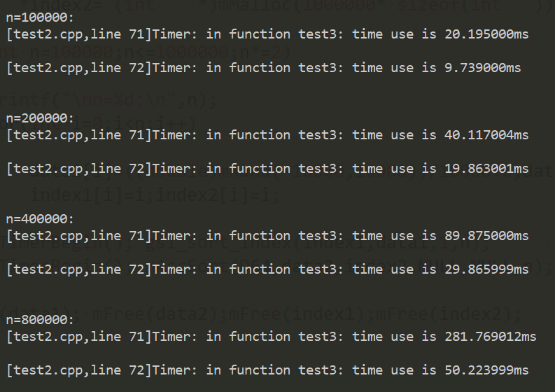
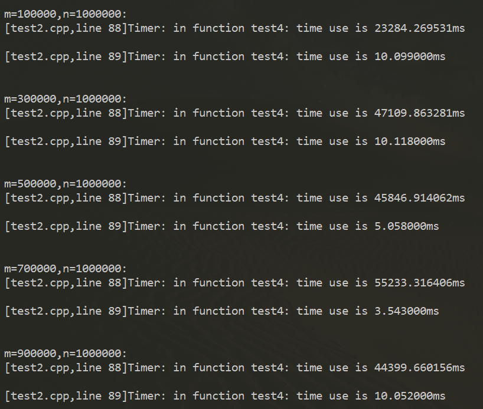

## Morn：排序

之前写了各种排序，后来都删掉了，现在的Morn里只保留了快速排序。

### 接口

此文档相关函数都定义在[../src/math/morn_sort.c](../src/math/morn_sort.c)里。

#### 升序排序

```c
void mAscSortD64(D64 *data_in,int *index_in,D64 *data_out,int *index_out,int num);
void mAscSortF32(F32 *data_in,int *index_in,F32 *data_out,int *index_out,int num);
void mAscSortS32(S32 *data_in,int *index_in,S32 *data_out,int *index_out,int num);
void mAscSortU32(U32 *data_in,int *index_in,U32 *data_out,int *index_out,int num);
void mAscSortS16(S16 *data_in,int *index_in,S16 *data_out,int *index_out,int num);
void mAscSortU16(U16 *data_in,int *index_in,U16 *data_out,int *index_out,int num);
void mAscSortS8 (S8  *data_in,int *index_in,S8  *data_out,int *index_out,int num);
void mAscSortU8 (U8  *data_in,int *index_in,U8  *data_out,int *index_out,int num);
```

或者，可以使用：

```c
void mAscSort(Type,Type* data_in,int *index_in,Type *data_out,int *index_out,int num);
```

其中，Type只支持D64（double），F32（float），S32（int），U32（unsigned int），S16（short），U16（unsigned short），S8（signed char） ，U8（unsigned char）八种类型。

data_in是数据的输入（待排序数据），data_out是数据的输出（排序后数据）。

data_out可以等于data_in，也就是输出覆盖输入。

data_out若设为NULL，则取其默认值为data_in，也即默认覆盖输入。

index_in是输入数据的顺序，index_out是输出数据的顺序，如果两者都取NULL，表示排序时不记录顺序。

index_in若取NULL，则表示使用默认的递增顺序，即0，1，2，3，……，num-1的顺序。

index_out可以等于index_in，也就是输出覆盖原输入顺序。

index_out若取NULL，则取默认值index_in，也即覆盖原输入顺序。

num是数据的个数。

例如：

```c
printf("\n\nin :");
for(int i=0;i<10;i++) {data[i] = mRand(-100,100);printf("%d,",data[i]);}
mAscSort(S32,data,NULL,NULL,index,10);
printf("\nout :");
for(int i=0;i<10;i++) {printf("%d(%d),",data[i],index[i]);}
```

其运行结果为

```
in :5,45,-19,-73,61,-9,95,42,-73,-64,
out :-73(8),-73(3),-64(9),-19(2),-9(5),5(0),42(7),45(1),61(4),95(6),
```


#### 降序排序

```c
void mDescSortD64(D64 *data_in,int *index_in,D64 *data_out,int *index_out,int num);
void mDescSortF32(F32 *data_in,int *index_in,F32 *data_out,int *index_out,int num);
void mDescSortS32(S32 *data_in,int *index_in,S32 *data_out,int *index_out,int num);
void mDescSortU32(U32 *data_in,int *index_in,U32 *data_out,int *index_out,int num);
void mDescSortS16(S16 *data_in,int *index_in,S16 *data_out,int *index_out,int num);
void mDescSortU16(U16 *data_in,int *index_in,U16 *data_out,int *index_out,int num);
void mDescSortS8 (S8  *data_in,int *index_in,S8  *data_out,int *index_out,int num);
void mDescSortU8 (U8  *data_in,int *index_in,U8  *data_out,int *index_out,int num);
```

或者，可以用：

```c
void mDescSort(Type,Type* data_in,int *index_in,Type *data_out,int *index_out,int num);
```

其参数与`mAscSort`相同，不再赘述。

例如：

```c
printf("\n\nin :");
for(int i=0;i<10;i++) {data[i] = mRand(-100,100);printf("%d,",data[i]);}
mDescSort(S32,data,NULL,NULL,NULL,10);
printf( "\nout :");
for(int i=0;i<10;i++) {printf("%d,",data[i]);}
```

其运行结果为

```
in :91,-96,2,53,-8,82,-79,16,18,-5,
out :91,82,53,18,16,2,-5,-8,-79,-96,
```


#### 最小值子集

也就是从num_in个数据里，取出num_out个最小的数，取出的数并无必要按照大小顺序排列。

```c
D64 mMinSubsetD64(D64 *data_in,int *index_in,int num_in,D64 *data_out,int *index_out,int num_out);
F32 mMinSubsetF32(F32 *data_in,int *index_in,int num_in,F32 *data_out,int *index_out,int num_out);
S32 mMinSubsetS32(S32 *data_in,int *index_in,int num_in,S32 *data_out,int *index_out,int num_out);
U32 mMinSubsetU32(U32 *data_in,int *index_in,int num_in,U32 *data_out,int *index_out,int num_out);
S16 mMinSubsetS16(S16 *data_in,int *index_in,int num_in,S16 *data_out,int *index_out,int num_out);
U16 mMinSubsetU16(U16 *data_in,int *index_in,int num_in,U16 *data_out,int *index_out,int num_out);
 S8 mMinSubsetS8 ( S8 *data_in,int *index_in,int num_in, S8 *data_out,int *index_out,int num_out);
 U8 mMinSubsetU8 ( U8 *data_in,int *index_in,int num_in, U8 *data_out,int *index_out,int num_out);
```

或者，可以用：

```c
Type mMinSubset(Type，Type *data_in,int *index_in,int num_in, Type *data_out,int *index_out,int num_out);
```

其参数Type、data_in、data_out、index_in、index_out与`mAscSort`相同，不再赘述。

num_in即输入数据的个数。num_out即输出数据的个数。

返回值是临界值，即输出数据中的最大值。

例如：

```c
printf("\n\nin :");
for(int i=0;i<10;i++) {data[i] = mRand(-100,100);printf("%d,",data[i]);}
mMinSubset(S32,data,NULL,10,NULL,index,4);
printf( "\nout :");
for(int i=0;i<4;i++) {printf("%d(%d),",data[i],index[i]);}
    
```

其运行结果为

```
in :47,-56,-38,57,-63,-41,23,41,29,78,
out :-41(5),-56(1),-38(2),-63(4),
```


#### 最大值子集

```c
D64 mMaxSubsetD64(D64 *data_in,int *index_in,int num_in,D64 *data_out,int *index_out,int num_out);
F32 mMaxSubsetF32(F32 *data_in,int *index_in,int num_in,F32 *data_out,int *index_out,int num_out);
S32 mMaxSubsetS32(S32 *data_in,int *index_in,int num_in,S32 *data_out,int *index_out,int num_out);
U32 mMaxSubsetU32(U32 *data_in,int *index_in,int num_in,U32 *data_out,int *index_out,int num_out);
S16 mMaxSubsetS16(S16 *data_in,int *index_in,int num_in,S16 *data_out,int *index_out,int num_out);
U16 mMaxSubsetU16(U16 *data_in,int *index_in,int num_in,U16 *data_out,int *index_out,int num_out);
 S8 mMaxSubsetS8 ( S8 *data_in,int *index_in,int num_in, S8 *data_out,int *index_out,int num_out);
 U8 mMaxSubsetU8 ( U8 *data_in,int *index_in,int num_in, U8 *data_out,int *index_out,int num_out);
```

或者，可以用：

```c
Type mMaxSubset(Type，Type *data_in,int *index_in,int num_in, Type *data_out,int *index_out,int num_out);
```

其参数与`mMinSubset`相同，不再赘述。

返回值是临界值，即输出数据中的最小值。

例如：

```c
printf("\n\nin :");
for(int i=0;i<10;i++) {data[i] = mRand(-100,100);printf("%d,",data[i]);}
mMaxSubset(S32,data,NULL,10,NULL,NULL,4);
printf( "\nout :");
for(int i=0;i<4;i++) {printf("%d,",data[i]);}    
```

其运行结果为

```
in :16,-65,90,-58,-12,6,-60,42,-36,-52,
out :16,42,90,6,
```


#### 容器排序

以上的排序都只针对“数”来进行排序，Morn的容器MList，还提供了更通用的排序`mListSort`，具体可参见文档[Morn:容器2](Morn：容器2)。


### 性能

在比较性能时，使用了Windows下的Mingw工具链。

#### 排序性能

这里，把Morn的排序与另外三种排序方法做了对比，它们分别是：①C语言标准库函数里的`qsort`函数，②科学计算库GSL里的`gsl_sort`函数，③C++ STL里的`stl::sort`函数。测试程序如下：

```c
#include <algorithm>
#include <gsl/gsl_sort_double.h>
#include "morn_math.h"

int compare(const void *v1, const void *v2) {return ((*((double *)v1))>(*((double *)v2)))?1:-1;}
void test1()
{
    double *data1= (double *)mMalloc(1000000* sizeof(double));
    double *data2= (double *)mMalloc(1000000* sizeof(double));
    double *data3= (double *)mMalloc(1000000* sizeof(double));
    double *data4= (double *)mMalloc(1000000* sizeof(double));
    
    for(int n=100000;n<=1000000;n*=2)
    {
        printf("\nn=%d:\n",n);
        for(int i=0;i<n;i++)
        {
            data1[i]=((double)mRand(-10000,10000))/10000.0;
            data2[i]=data1[i];data3[i]=data1[i];data4[i]=data1[i];
        }
        mTimerBegin(); qsort(data1,n,sizeof(int),compare);  mTimerEnd();
        mTimerBegin(); gsl_sort(data2,1,n);                 mTimerEnd();
        mTimerBegin(); std::sort(data3,data3+n);            mTimerEnd();
        mTimerBegin(); mAscSort(D64,data4,NULL,NULL,NULL,n);mTimerEnd();
    }
    
    mFree(data1); mFree(data2); mFree(data3); mFree(data4);
}
```

以上分别对100000、400000、800000个随机生成的双精度浮点数进行排序，其运行结果如下：


可以看到`std::sort`和Morn的Morn的`mAscSort`速度最快（两者基本上同一水平，`std::sort`稍快），其次是`qsort`函数，最慢的是`gsl_sort`函数。（这儿有一点儿不公平，`qsort`使用回调函数排序，虽然慢，但是有更广泛的应用。）


#### 最大最小值子集的性能

这里比较了Morn的`mMinSubset`函数，和科学计算库GSL的`gsl_sort_smallest`函数。测试程序如下：

```c
void test2()
{
    int n=1000000;int m;
    double *in  = (double *)mMalloc(n * sizeof(double));
    double *out1= (double *)mMalloc(n * sizeof(double));
    double *out2= (double *)mMalloc(n * sizeof(double));
    for (int i=0;i<n;i++) in[i] = ((double)mRand(-10000,10000))/10000.0;
    
    for(m=100000;m<n;m+=200000)
    {
        printf("\nm=%d,n=%d:\n",m,n);
        mTimerBegin(); gsl_sort_smallest(out1,m,in,1,n);      mTimerEnd();
        mTimerBegin(); mMinSubset(D64,in,NULL,n,out2,NULL,m); mTimerEnd();
    }

    mFree(in); mFree(out1); mFree(out2);
}
```

这里，从1000000个随机生成的double数据中，分别取出100000、300000、500000、700000、900000个数据，测试结果如下：


可以看到，两者的耗时差了至少3个数量级。（`gsl_sort_smallest`为什么比`gsl_sort`还慢？）
不过这里需要说明的是：`gsl_sort_smallest`和`mMinSubset`函数的功能不完全相同，它们虽然都是从m个数据中取出最小的n个，但是`gsl_sort_smallest`取出的数据是按照顺序排列好的，其取值的阈值就是`out1[m-1]`；`mMinSubset`取出的数据是无序的，其取值的阈值是函数的返回值。（通常应用中并不需要所取出的数据有序，倘若确有有序的需求的话，可以在之后再使用`mAscSort`或`mDescSort`函数进行排序，即使此函数之后再排序也比`gsl_sort_smallest`函数快得多）。

#### 带索引排序的性能
这里比较的是Morn的`mAscSort`和GSL的`gsl_sort_index`函数。测试程序如下：
```c
void test3()
{
    double *data1 = (double *)mMalloc(1000000* sizeof(double));
    double *data2 = (double *)mMalloc(1000000* sizeof(double));
    size_t *index1= (size_t *)mMalloc(1000000* sizeof(size_t));
    int    *index2= (int    *)mMalloc(1000000* sizeof(int   ));

    for(int n=100000;n<=1000000;n*=2)
    {
        printf("\nn=%d:\n",n);
        for(int i=0;i<n;i++)
        {
            data1[i]=((double)mRand(-10000,10000))/10000.0;data2[i]=data1[i];
        }
        mTimerBegin(); gsl_sort_index(index1,data1,1,n);      mTimerEnd();
        mTimerBegin(); mAscSort(D64,data2,NULL,NULL,index2,n);mTimerEnd();
    }
    
    mFree(data1); mFree(data2);mFree(index1);mFree(index2);
}
```
以上分别对100000、400000、800000个随机生成的双精度浮点数进行排序，其运行结果如下：



显然Morn的排序更快。
这里`gsl_sort_index`与`mAscSort`也是有区别的。`gsl_sort_index`只输出排序后的索引，对数据不会排序。`mAscSort`对数据和索引都会排序。

#### 带索引的最大最小值子集的性能
这里比较了Morn的`mMaxSubset`函数和GSL的`gsl_sort_largest_index`函数，测试程序如下：
```c
void test4()
{
    int n=1000000;int m;
    double *in  = (double *)mMalloc(n * sizeof(double));
    size_t *out1= (size_t *)mMalloc(n * sizeof(size_t));
    int    *out2= (int    *)mMalloc(n * sizeof(int   ));
    for (int i=0;i<n;i++) in[i] = ((double)mRand(-10000,10000))/10000.0;
    
    for(m=100000;m<n;m+=200000)
    {
        printf("\nm=%d,n=%d:\n",m,n);
        mTimerBegin(); gsl_sort_largest_index(out1,m,in,1,n); mTimerEnd();
        mTimerBegin(); mMaxSubset(D64,in,NULL,n,NULL,out2,m); mTimerEnd();
    }

    mFree(in); mFree(out1); mFree(out2);
}
```
这里，从1000000个随机生成的double数据中，分别取出100000、300000、500000、700000、900000个数据，测试结果如下：

显然Morn的排序快的多。
这里`gsl_sort_largest_index`与`mMaxSubset`也是有区别的。`gsl_sort_largest_index`只输出排序后的索引，且索引对应的数据是有序的。`mAscSort`会输出索引和数据，且数据是无序的。

总结一下：

|项目|Morn|std::sort|GSL|qsort|
|-|-|-|-|-|
|速度|快|快|慢|较慢|
|数据类型|任意数值类型，其他类型使用`mListSort`|任意类型|double|任意类型（使用void*)|
|索引|有|无（但可借助回调函数实现）|有|无（但可借助回调函数实现）|
|支持回调|`mListSort`支持|支持|不支持|支持|
|降序排序|支持|借助回调函数|不支持|借助回调函数|
|最大最小子集|支持|不支持|支持|不支持|

