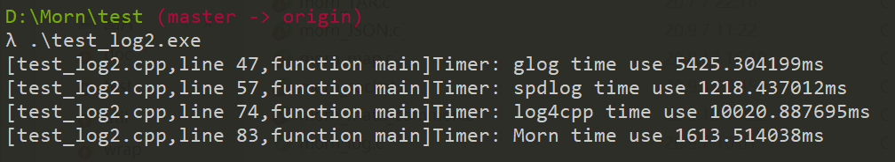

## Morn：日志

Morn的日志是一个极简的，几乎没有学习成本的日志。它可以实现：

*  多种输出，包括动态文件、控制台、和用户自定义输出。

* 日志分级，选择性的日志输出，可自定义日志级别

* 预设日志格式，支持自定义格式

* 根据日志文件大小，自动分割日志文件。

* 线程安全

* 异步日志

  

### 接口

Morn日志相关的接口极简单，只有`mLogSet`和`mLog`两个接口，其中前者用于配置日志参数，后者用于输出日志。

#### 输出日志

```c
void mLog(int Level,const char *format,...);
```

这个接口简单到几乎可以不去解释。一个简单的例子：

```
int main()
{
    mLog(MORN_INFO, "this is a Morn log, num=%d\n",1);
    return 0;
}
```

其运行的结果为：

```
this is a Morn log, num=1
```


#### 日志格式

**预定义格式**

Morn里使用语法糖`mLogFormat`预设了**5种**日志格式。以下例说明之：

```c
int main()
{
    mLog(MORN_INFO, mLogFormat(1,"this is a Morn log, format %d"),1);
    mLog(MORN_INFO, mLogFormat(2,"this is a Morn log, format %d"),2);
    mLog(MORN_INFO, mLogFormat(3,"this is a Morn log, format %d"),3);
    mLog(MORN_INFO, mLogFormat(4,"this is a Morn log, format %d"),4);
    mLog(MORN_INFO, mLogFormat(5,"this is a Morn log, format %d"),5);
    return 0;
}
```

此程序的输出为：

```
[test_log.c,line 16,function main]Info: this is a Morn log, format 1
[2020.09.13 18:03:43]Info: this is a Morn log, format 2
[thread001]Info: this is a Morn log, format 3
[2020.09.13 18:03:43 thread001]Info: this is a Morn log, format 4
[2020.09.13 18:03:43 thread001 test_log.c,line 20,function main]Info: this is a Morn log, format 5
```

Morn库所有自带的日志输出（例如定时信息、异常信息），皆采用格式1。

值得一提的是`mLogFormat`只是一个语法糖，只有以上一种用法，以下两种用法是错误的：

```c
int a=5;
mLog(MORN_INFO, mLogFormat(a,"this is a Morn log"));//错误用法

char *message = "this is a Morn log";
mLog(MORN_INFO, mLogFormat(5,message));				//错误用法
mLog(MORN_INFO, mLogFormat(5,"%s"),message);		//正确用法
```

如果误用`mLogFormat`，将会导致编译语法错误。

**自定义格式**

Morn认为：任何的预设格式都未必能满足用户的所有需求，Morn鼓励用户自定义日志格式。

例如，需要在日志格式中输出程序的作者，最简单的方式是：

```c
mLog(MORN_INFO, "[%s,line %d,function %s,author:%s]%s: this is a Morn log" ,__FILE__,__LINE__,__FUNCTION__,"JingWeiZhangHuai",mLogLevel(),1);
```

或

```c
mLog(MORN_INFO, mLogFormat(1,"author:%s. this is a Morn log"),"JingWeiZhangHuai",1);
```

以上两种方法皆可，但过于繁琐，Morn所鼓励的方式是仿照`mLogFormat`的方式定义日志格式，即：

```c
//定义在头文件中
#define MY_FORMAT(Message) "[%s,line %d,function %s,author:%s]%s:"  Message  "\n", __FILE__,__LINE__,__FUNCTION__,"JingWeiZhangHuai",mLogLevel()

//使用在函数中
mLog(MORN_INFO, MY_FORMAT("this is a Morn log"));
```

以下列出了几种可能在自定义格式时可能用到的接口：

* 日志等级

```c
const char *mLogLevel();  		
```

此接口返回`mLog`中所输入的level。为字符串："Debug"，“Info"，"Warning"或"Error"。

* 当前时间

```c
const char *mTimeString(int64_t time_value,const char *format);
```

详见[Morn：时间和日期](./Morn：时间和日期)。在日志中常使用`mTimeString(DFLT,NULL)`。

* 当前线程

```c
int mThreadID();
```

返回值为当前线程编号，此编号并非系统中的线程ID，是由1开始递增的整数，如第一个线程返回1，第二个线程返回2等。


#### 设置属性

对日志属性的设置使用`mPropertyWrite`接口，向`"Log"`模块写入属性。日志行为在`mPropertyWrite`后生效。

**设置日志输出等级**

```c
mPropertyWrite("Log","log_level",(int *)p_log_level,sizeof(int));
```

属性名为`"log_level"`。属性为int型整数。

当`mLog`函数中指定的日志级别大于等于此level_level时，日志才会被输出，否则被忽略。

Morn预设的日志级别由低到高分别是`MORN_DEBUG`，`MORN_INFO`，`MORN_WARNING`，`MORN_ERROR `，他们的定义分别为：

```c
#define MORN_DEBUG    0
#define MORN_INFO    16
#define MORN_WARNING 32
#define MORN_ERROR   48
```

例如，设置日志输出级别为MORN_WARNING，则程序应如下：

```c
int log_level = MORN_WARNING;
mPropertyWrite("Log","log_level",&log_level,sizeof(int));
```

未设置日志级别时，默认日志级别为Info（Release版本）或Debug（Debug版本）。

用户除了可以使用以上四种级别外，还可以自定义日志级别。例如定义一种日志级别为NOTICE，其日志级别高于INFO低于WARNING，则可定义为

```c
#define NOTICE (MORN_INFO+1)
mLog(NOTICE, "this is a Morn log, num=%d\n",1);
```

一个示例程序如下：

```c
int main()
{
    int log_level = MORN_INFO;
    mPropertyWrite("Log","log_level",&log_level,sizeof(int));
    
    mLog(MORN_DEBUG  ,"this is a debug log\n");
    mLog(MORN_INFO   ,"this is a info log\n");
    mLog(MORN_WARNING,"this is a warning log\n");
    mLog(MORN_ERROR  ,"this is a error log\n\n");

    #define REMARK MORN_INFO+1
    log_level = REMARK;
    mPropertyWrite("Log","log_level",&log_level,sizeof(int));

    mLog(MORN_DEBUG  , "this is a debug log\n");
    mLog(MORN_INFO   , "this is a info log\n");
    mLog(REMARK      , "this is a remark log\n");
    mLog(MORN_WARNING, "this is a warning log\n");
    mLog(MORN_ERROR  , "this is a error log\n\n");
    
    return 0;
}
```

此程序的输出结果如下：

```
this is a info log
this is a warning log
this is a error log

this is a remark log
this is a warning log
this is a error log
```


**设置日志文件**

```c
mPropertyWrite("Log","log_file",(const char *)filename); //向文件中打印日志
mPropertyWrite("Log","log_file","exit"); 				 //停止向日志中打印日志
```

属性名为`"log_file"`。属性为字符串。

**设置日志文件大小**

```c
mPropertyWrite("Log","log_filesize",(int *)p_filesize,sizeof(int));
```

属性名为`"log_filesize"`。属性为int型整数，代表文件字节数。

只有设置了`"log_file"`时此项才有效。若不设置此项，则所有日志将输出到同一文件中（不作分割）。否则日志文件大小超过此值时，将会新建一个新的日志文件。


**设置日志的控制台输出**

```c
mPropertyWrite("Log","log_console",&p_log_console,sizeof(int));
```

属性名为`"log_filesize"`。属性为int型布尔值，非0表示使能控制台打印，0表示禁能控制台打印。

未设置此项时，默认使能控制台输出。


以下程序示例了日志的文件和控制台混合输出：

```c
int main()
{
    mLog(MORN_INFO, "this is log No.1\n");
    mPropertyWrite("Log","log_file","./test_log.log");
    mLog(MORN_INFO, "this is log No.2\n");
    mPropertyWrite("Log","log_file","exit");
    mLog(MORN_INFO, "this is log No.3\n");
    mPropertyWrite("Log","log_file","./test_log2.log");
    mLog(MORN_INFO, "this is log No.4\n");
    int log_console = 1;
    mPropertyWrite("Log","log_console",&log_console,sizeof(int));
    mLog(MORN_INFO, "this is log No.5\n");
    log_console = 0;
    mPropertyWrite("Log","log_console",&log_console,sizeof(int));
    mLog(MORN_INFO, "this is log No.6\n");
    mPropertyWrite("Log","log_file","exit");
    mLog(MORN_INFO, "this is log No.7\n");
    return 0;
}
```

以上：

第一条日志未设置输出方式，默认为控制台输出。

第二条日志设置了输出到文件`"./test_log.log"`，因此将输出到文件。

第三条日志因设置了结束文件输出，因此将输出到控制台

第四条日志设置了输出到文件`"./test_log2.log"`，因此将输出到文件。

第五条日志设置了控制台输出使能，因此将同时输出到文件和控制台。

第六条日志因禁能了控制台输出，因此将输出到文件。

第七条日志因设置了结束文件输出，因此将输出到控制台。

因此：在控制台将得到：

```
this is log No.1
this is log No.3
this is log No.5
this is log No.7
```

在`"./test_log.log"`文件将得到：

```
this is log No.2
```

在`"./test_log2.log"`文件将得到：

```c
this is log No.4
this is log No.5
this is log No.6
```


**自定义日志输出**

```c
mPropertyWrite("Log","log_function",&func,sizeof(void *));  //设置日志输出函数
```

属性名为`"log_function"`。属性为void**型指针。

```c
mPropertyWrite("Log","log_func_para",&para,sizeof(void *));	//设置日志函数的参数
```

属性名为`"log_func_para"`。属性为void**型指针。

Morn认为：无论提供多少种日志输出方式都未必能够满足所有的应用场景，最好的办法是允许用户自定义日志的输出方式。

其使用方法如下例：自定义文件通过UDP协议传输到另一台计算机上，云端计算机的IP地址和端口号作为函数参数。

```c
void send_log(char *log,int size,char *addr)
{
    mUDPWrite(addr,log,size);
}

int main()
{
    void *func=send_log;
    mPropertyWrite("Log","log_function",&func,sizeof(void *));
    
    char *para = "192.168.1.111:1234";
    mPropertyWrite("Log","log_func_para",&para,sizeof(char *));
    
    mLog(MORN_INFO, "this is a Morn log\n");
    return 0;
}
```


### 性能

为了测试Morn日志的性能，使用以下程序进行了测试，测试中将Morn日志与常用的glog、spdlog、log4cpp三种日志库进行比较：

```cpp
#include <stdio.h>
#include <string.h>
#include <stdlib.h>
#include<iostream>

#include "glog/logging.h"

#include "spdlog/spdlog.h"
#include "spdlog/sinks/basic_file_sink.h"

#include "log4cpp/Category.hh"
#include "log4cpp/FileAppender.hh"
#include "log4cpp/Priority.hh"
#include "log4cpp/PatternLayout.hh"

#include "morn_util.h"

int main(int argc, char** argv)
{
    char datas[100][32];
    int datai[100];
    double datad[100];
    for(int i=0;i<100;i++)
    {
        //生成随机整数
        datai[i]=mRand(DFLT,DFLT);
        //生成随机浮点数
        datad[i]=(double)mRand(-1000000,1000000)/1000000.0;
        //生成随机字符串
        int len = mRand(15,31);
        for(int j=0;j<len;j++)datas[i][j]=mRand('a','z');
        datas[i][len]=0;
    }
    
    mTimerBegin("glog");
    google::InitGoogleLogging(argv[0]);
    google::SetLogDestination(google::GLOG_INFO, "./test_log_glog.log");
    for(int n=0;n<1000000;n++)
    {
        int i=n%100;
        LOG(INFO)<<": Hello glog, "<<"datai="<<datai[i]<<", datad="<<datad[i]<<", datas="<<&(datas[i][0]);
    }
    google::ShutdownGoogleLogging();
    mTimerEnd("glog");

    mTimerBegin("spdlog");
    auto console2 = spdlog::basic_logger_mt(argv[0],"./test_log_spdlog.log");
    spdlog::set_pattern("[%Y.%m.%d %H:%M:%S thread%t]%l: %v");
    for(int n=0;n<1000000;n++)
    {
        int i=n%100;
        console2->info("[{} line {},function {}] Hello spdlog, datai={}, datad={}, datas={}",__FILE__,__LINE__,__FUNCTION__,datai[i],datad[i],&(datas[i][0]));
    }
    mTimerEnd("spdlog");

    mTimerBegin("log4cpp");
    log4cpp::FileAppender * appender = new log4cpp::FileAppender("appender","./test_log_log4cpp.log");
    log4cpp::PatternLayout* pLayout = new log4cpp::PatternLayout();
    pLayout->setConversionPattern("[%d thread%t %c]%p: %m%n");
    appender->setLayout(pLayout);
    log4cpp::Category& root =log4cpp::Category::getRoot();
    log4cpp::Category& infoCategory =root.getInstance(argv[0]);
    infoCategory.addAppender(appender);
    infoCategory.setPriority(log4cpp::Priority::INFO);
    for(int n=0;n<1000000;n++)
    {
        int i=n%100;
        infoCategory.info("[%s,line %d,function %s] Hello log4cpp, datai=%d, datad=%f, datas=%s",__FILE__,__LINE__,__FUNCTION__,datai[i],datad[i],&(datas[i][0]));
    }
    log4cpp::Category::shutdown();
    mTimerEnd("log4cpp");

    mTimerBegin("Morn");
    mPropertyWrite("Log","log_file","./test_log_morn.log");
    for(int n=0;n<1000000;n++)
    {
        int i=n%100;
        mLog(MORN_INFO,mLogFormat5("Hello Morn, datai=%d, datad=%f, datas=%s"),datai[i],datad[i],&(datas[i][0]));
    }
    mTimerEnd("Morn");

    return 0;
}
```

以上分别测试了1000000输出条日志所需时间。四种日志的输出分别是：

* glog

```c
I20200913 21:14:36.839823   148 test_log2.cpp:48] : Hello glog, datai=17729, datad=-0.761655, datas=cuppeubmapohxinsmwoumohsrmfdi
```
* spdlog

```c
[2020.09.13 21:14:44 thread148]info: [test_log2.cpp line 59,function main] Hello spdlog, datai=17729, datad=-0.761655, datas=cuppeubmapohxinsmwoumohsrmfdi
```
* log4cpp

```
[2020-09-13 21:14:45,783 thread148 .\test_log2.exe]INFO: [test_log2.cpp,line 75,function main] Hello log4cpp, datai=17729, datad=-0.761655, datas=cuppeubmapohxinsmwoumohsrmfdi
```
* Morn

```
[2020.09.13 21:15:15 thread001 test_log2.cpp,line 85,function main]Info: Hello Morn, datai=17729, datad=-0.761655, datas=cuppeubmapohxinsmwoumohsrmfdi
```

测试结果为：



以上可见：

| 类别    | 速度（条/秒） | 速度（kB/s) |
| ------- | ------------- | ----------- |
| glog    | 18432         | 22319       |
| spdlog  | 82072         | 119414      |
| log4cpp | 9979          | 16574       |
| Morn    | 61977         | 87197       |

Morn的速度慢于spdlog，但是远快于glog和log4cpp。