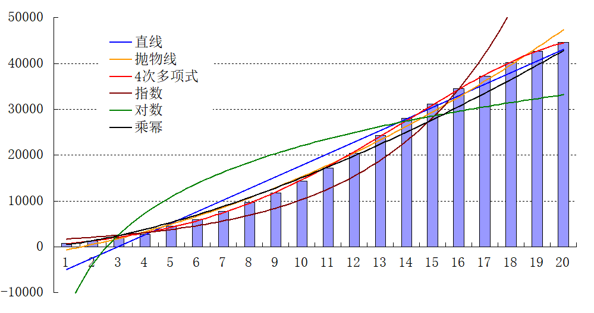

## Morn：曲线拟合

所谓的数据拟合就是找到一条合适的曲线（求出曲线方程中的参数）用以描述自变量和因变量的关系。因此曲线拟合的输入是一组互相对应的自变量和因变量，其输出是曲线方程中的参数。

常见的曲线包括直线（线性方程），抛物线（二次方程），多项式曲线（n次方程），对数曲线，乘幂曲线，指数曲线等。

曲线拟合的最基本方法是最速下降法。

### 接口

#### 最小二乘法（LSM）做曲线拟合

```c
void mLinearFitLSM(float *x,float *y,int N,float *a);
void mParabolaFitLSM(float *x,float *y,int N,float *a);
void mPolyFitLSM(float *x,float *y,int N,float *a,int k);
void mExpFitLSM(float *x,float *y,int N,float *a);
void mLnFitLSM(float *x,float *y,int N,float *a);
void mPowerFitLSM(float *x,float *y,int N,float *a);
```

这其中包括：

拟合直线`mLinearFitLSM`：y=a[0]*x+a[1]；

拟合抛物线`mParabolaFitLSM`：y=a[0]\*x^2+a[1]\*x+a[2]；

拟合多项式曲线`mPolyFitLSM`：y=a[0]\*x^k+a[1]\*x^(k-1)+...a[k-1]*x+a[k]；

拟合指数曲线`mExpFitLSM`：y=a[0]*exp(a[1]\*x)；

拟合对数曲线`mLnFitLSM`：y=a[0]*ln(x)+a[1]；

拟合乘幂曲线`mPowerFitLSM`：y=a[0]*x^a[1]；

接口中，x和y分别是输入的一组自变量和因变量的首地址，N是自变量（和因变量）的个数。a是拟合得到的曲线方程参数。

对于多项式拟合，除以上参数外，还需要输入多项式的次数k，若k置为1则相当于直线拟合，若k置为2则相当于抛物线拟合。

#### 带有权重的曲线拟合

```c
void mLinearFitWeight(float *x,float *y,float *WIn,int N,float *a);
void mParabolaFitWeight(float *x,float *y,float *WIn,int N,float *a);
void mPolyFitWeight(float *x,float *y,float *WIn,int N,float *a,int k);
```

在做曲线拟合的时候，往往有一些关键点，他们对于拟合结果更加敏感，在拟合时需要着重考虑，这也就是说，对于不同的点，需要赋予其不同的权重，权重越高，对拟合的结果影响越大，反之亦然。

此三个函数与`mLinearFitLSM`、`mParabolaFitLSM`、`mPolyFitLSM`三个函数类似。只是增加了权重w。

#### 去异常点拟合

```c
void mLinearFit(float *x,float *y,int N,float *a);
void mParabolaFit(float *x,float *y,int N,float *a);
void mPolyFit(float *x,float *y,int N,float *a,int k);
void mExpFit(float *x,float *y,int N,float *a);
void mLnFit(float *x,float *y,int N,float *a);
void mPowerFit(float *x,float *y,int N,float *a);
```

此几个函数与最小二乘法直接拟合的区别在于：对异常点不敏感。

当给定的点（一对自变量和因变量）中存在异常点时，使用最小二乘法进行拟合往往会得到偏差很大（甚至错误）的结果。当给定数据中存在异常值的时候，往往就需要这里给出的拟合方案。

#### 折线拟合

```c
void mPiecewiseLinearFit(float *x,float *y,int N,int piece_num,MList *list);
```

此函数用以将给定的数据拟合成若干条线段，这些线段首尾相接构成一个分段函数。

这里，piece_num是指定的折线的个数，list是存放结果的容器，其中存放了各个折线的起点和终点。


### 示例

这里以2020年国内新冠肺炎数据为例：

拟合抛物线`mParabolaFitLSM`：y=a[0]\*x^2+a[1]\*x+a[2]；

拟合多项式曲线`mPolyFitLSM`

```
新冠肺炎  确诊   新增   湖北 省外
1月23日   830   259   105 154
1月24日  1287   457   180 277
1月25日  1975   688   323 365
1月26日  2744   769   371 398
1月27日  4515  1771  1291 480
1月28日  5974  1459   840 619
1月29日  7711  1737  1032 705
1月30日  9692  1982  1220 762
1月31日 11791  2102  1347 755
2月01日 14380  2590  1921 669
2月02日 17205  2829  2103 726
2月03日 20438  3235  2345 890
2月04日 24324  3887  3156 731
2月05日 28018  3694  2987 707
2月06日 31161  3143  2447 696
2月07日 34546  3399  2841 558
2月08日 37198  2656  2147 509
2月09日 40171  3062  2618 444
2月10日 42638  2478  2097 381
2月11日 44653  2015  1638 377
2月12日 59804 15152 14840 312
2月13日 63851  5090  4823 267
2月14日 66492  2641  2420 221
2月15日 68500  2009  1843 166
```


首先针对1月23日至2月11日的确诊病例数来做拟合。

```c
    float x[21]={1,2,3,4,5,6,7,8,9,10,11,12,13,14,15,16,17,18,19,20,21};
    float y[21]={830,1287,1975,2744,4515,5974,7711,9692,11791,14380,17205,
                 20438,24324,28018,31161,34546,37198,40171,42638,44653,59804};
    float a[5];
    mLinearFitLSM(x,y,20,a);
    printf("linear fit result is y=(%f)*x+(%f)\n",a[0],a[1]);
    mParabolaFitLSM(x,y,20,a);
    printf("parabola fit result is y=(%f)*x^2+(%f)*x+(%f)\n",a[0],a[1],a[2]);
    mPolyFitLSM(x,y,20,a,4);
    printf("poly fit result is y=(%f)*x^4+(%f)*x^3+(%f)*x^2+(%f)*x+(%f)\n",a[0],a[1],a[2],a[3],a[4]);
    mExpFitLSM(x,y,20,a,4);
    printf("exp fit result is y=%f*exp(%f*x)\n",a[0],a[1]);
    mLnFitLSM(x,y,20,a,4);
    printf("ln fit result is y=%f*ln(x)+(%f)\n",a[0],a[1]);
    mPowerFitLSM(x,y,20,a,4);
    printf("power fit result is y=%f*x^(%f)\n",a[0],a[1]);
```

得到的结果如下：

```
linear fit result is y=(2524.469727)*x+(-7444.383789)
parabola fit result is y=(75.436073)*x^2+(940.312012)*x+(-1635.803467)
poly fit result is y=(-0.577676)*x^4+(17.067251)*x^3+(-31.071037)*x^2+(636.084473)*x+(82.394943)
exp fit result is y=1388.677124*exp(0.200764*x)
ln fit result is y=16043.795898*ln(x)+(-14898.630859)
power fit result is y=475.610138*x^(1.502059)
```



以上拟合，显然4次多项式曲线的拟合效果最好（实际上根据泰勒级数展开，多项式曲线可以近似表示任意函数曲线）。


以上是1月23日至2月11日的拟合结果，实际上因为2月12日湖北省修改了病例统计方法（加入了临床病例），因此如果将1月12日的数据一并使用最小二乘法进行拟合的话，得到的结果将失去价值。这时候可以将2月12日数据当做一个异常点处理。

```c
mPolyFitLSM(x,y,21,a,4);
printf("poly(LSM) fit result is y=(%f)*x^4+(%f)*x^3+(%f)*x^2+(%f)*x+(%f)\n", a[0],a[1],a[2],a[3],a[4]);
mPolyFit(x,y,21,a,4);
printf("poly fit result is y=(%f)*x^4+(%f)*x^3+(%f)*x^2+(%f)*x+(%f)\n", a[0],a[1],a[2],a[3],a[4]);
```

此时得到的结果如下：

```
poly(LSM) fit result is 
y=(0.843797)*x^4+(-37.602444)*x^3+(648.556702)*x^2+(-2370.319824)*x+(3516.477295)
poly fit result is 
y=(-0.577676)*x^4+(17.067251)*x^3+(-31.071037)*x^2+(636.084473)*x+(82.394943)
```

可以看到使用`mPolyFitLSM`得到的拟合结果与之前的结果差别很大，显然是受到了异常点的影响。而使用`mPolyFit`所获得的结果与之前的结果完全一致，说明已经排除了异常值得影响。

同样，我们可以对新增病例数进行拟合。以下是对1月23日至2月15日湖北省外新增病例数据进行的拟合。

```c
float x[24]={1,2,3,4,5,6,7,8,9,10,11,12,13,14,15,16,17,18,19,20,21,22,23,24};
float y[24]={154,277,365,398,480,619,705,762,755,669,726,890,
                  731,707,696,558,509,444,381,377,312,267,221,166};
float a[4];
mPolyFit(x1,y1,24,a1,3);
printf("fit result is y=(%f)*x^3+(%f)*x^2+(%f)*x+(%f)\n",
       a[0],a[1],a[2],a[3]);
```

