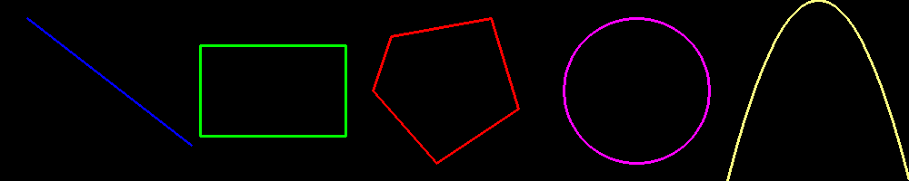

## Morn：绘图

为了满足图像标记的需求，Morn提供了一系列图形绘图函数。这些图形的定义另见文档[../Morn：平面几何](Morn：平面几何)。


### 接口

#### 图形轮廓绘制

```c
void mImageDrawPoint(MImage *src,MImage *dst,MImagePoint *point,unsigned char *color,int width);
void mImageDrawRect(MImage *src,MImage *dst,MImageRect *rect,unsigned char *color,int width);
void mImageDrawLine(MImage *src,MImage *dst,MImagePoint *p1,MImagePoint *p2,unsigned char *color,int width);
void mImageDrawCircle(MImage *src,MImage *dst,MImageCircle *circle,unsigned char *color,int width);
void mImageDrawShape(MImage *src,MImage *dst,MList *shape,unsigned char *color,int width);
```

这里包括了，绘制点（point）、绘制矩形（rect）、绘制直线（端点为p1/p2）、绘制圆（circle）、绘制多边形（shape）。

src是待绘制的图像，dst是绘制后的图像，dst若设为NULL，则绘制后覆盖原图。

color是图形轮廓的颜色，若取NULL，则使用默认颜色（如果为RGB三通道图像，则默认颜色为：红：0，绿：255，蓝：128，若为单通道灰度图，则默认颜色为：灰度值：128）。

width为线宽，可以取1/2/3/4四种，单位是像素，默认值是1。


#### 函数绘制

```c
void mImageDrawCurve(MImage *src,MImage *dst,float (*func)(float,void *),void *para,unsigned char *color,int width);
```

这里的函数指的是中学数学里的函数，即横坐标x对应确定唯一的纵坐标y。

func即函数方程，para即func的参数（可以没有参数，设为NULL）。

其它参数与图形轮廓绘制的参数相同，不再赘述。


#### 矩形填充

```c
void mImageFillRect(MImage *src,MImage *dst,MImageRect *rect,unsigned char *color)；
```

即在矩形内填充纯色。参数与轮廓绘制相同，不再赘述。


### 示例

```c
int main()
{
    MImage *img = mImageCreate(3,200,1000,NULL);
    for(int j=0;jheight;j++)
    {
        memset(img->data[0][j],0,img->width*sizeof(unsigned char));
        memset(img->data[1][j],0,img->width*sizeof(unsigned char));
        memset(img->data[2][j],0,img->width*sizeof(unsigned char));
    }
    unsigned char color[3];
    
    color[0]=255;color[1]=0;color[2]=0;
    MImagePoint p1,p2;
    mPoint(&p1,30,20);
    mPoint(&p2,210,160);
    mImageDrawLine(img,img,&p1,&p2,color,3);
    
    color[0]=0;color[1]=255;color[2]=0;
    MImageRect rect;
    mRect(&rect,220,50,380,150);
    mImageDrawRect(img,img,&rect,color,3);
    
    color[0]=0;color[1]=0;color[2]=255;
    MList *polygon = mListCreate(DFLT,NULL);
    mPolygon(polygon,5,430,40,540,20,570,120,480,180,410,100);
    mImageDrawShape(img,img,polygon,color,3);
    mListRelease(polygon);
    
    color[0]=255;color[1]=0;color[2]=255;
    MImageCircle circle;
    mCircle(&circle,700,100,80);
    mImageDrawCircle(img,img,&circle,color,3);
    
    float func(float x,void *para) {return (x-900)*(x-900)/50;}
    mImageDrawCurve(img,img,func,NULL,NULL,3);
    
    mBMPSave(img,"./test_draw.png");
    mImageRelease(img);
    return 0;
}
```

以上程序中，分别绘制了一条直线，一个矩形，一个五边形，一个圆，和一个一元二次方程。

所得结果如下：

